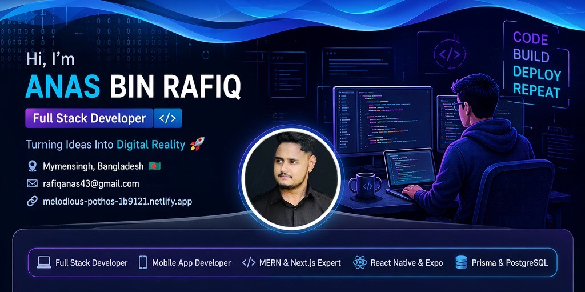

  

<h1 align="center">
  
</h1>

  <strong>Passionate developer from Mymensingh, Bangladesh 🇧🇩 turning code into interactive digital experiences.</strong>

  <a href="#-about-me">About Me</a> •
  <a href="#-tech-stack">Tech Stack</a> •
  <a href="#-featured-projects">Projects</a> •
  <a href="#-github-analytics">Analytics</a> •
  <a href="#-connect-with-me">Connect</a>

---

## 💫 About Me

I am a versatile **Full Stack Web & Mobile App Developer** with a relentless passion for creating seamless, scalable, and user-centric applications. With expertise in the **MERN Stack**, **Next.js**, and now proficient in modern mobile development using **React Native (Expo)** and robust backend architecture with **Prisma ORM**, I bridge the gap between complex logic and beautiful user experiences.

- 🛠️ Effectively building responsive web applications and cross-platform mobile apps.
- 🎓 Deeply exploring **PostgreSQL** and sophisticated database management with **Prisma**.
- 🚀 Leveraging **Firebase** for real-time capabilities and secure authentication.
- 🔭 Always keen to learn new technologies and improve code quality.

---

## 🛠️ My Tech Stack

### 🌐 Frontend Development (Web & Mobile)

  
  
  
  
  
  
  
  
  

### 🔙 Backend & Database

  
  
  
  
  
  

### 🔧 Tools & Hosting

  
  
  
  
  
  

---

## 🏆 Featured Projects

Here are some of my significant projects that demonstrate my skills:

<table border="1" cellspacing="0" cellpadding="10" width="100%">
  <tr>
    <td width="50%" valign="top">
      <h3>1️⃣ Service Lane (MERN Stack)</h3>
      
A comprehensive web application for sharing, booking, and managing services with role-based access.

      
<strong>Tech:</strong> React, Node.js, Express.js, MongoDB, Firebase, Tailwind CSS

      <a href="https://aeleven-66e92.web.app/">🌐 Live Site</a> | <a href="#">💻 Repo (Private)</a>
    </td>
    <td width="50%" valign="top">
      <h3>2️⃣ Upcoming App Project (React Native)</h3>
      
A cross-platform mobile app built with Expo, integrating Prisma for efficient data management.

      
<strong>Tech:</strong> React Native, Expo, Prisma, PostgreSQL

      <a href="#">📱 Coming Soon</a>
    </td>
  </tr>
</table>

---

## 📈 GitHub Analytics

  

  

  

---

## 🤝 Connect with Me

  
  
  
  

---

  

